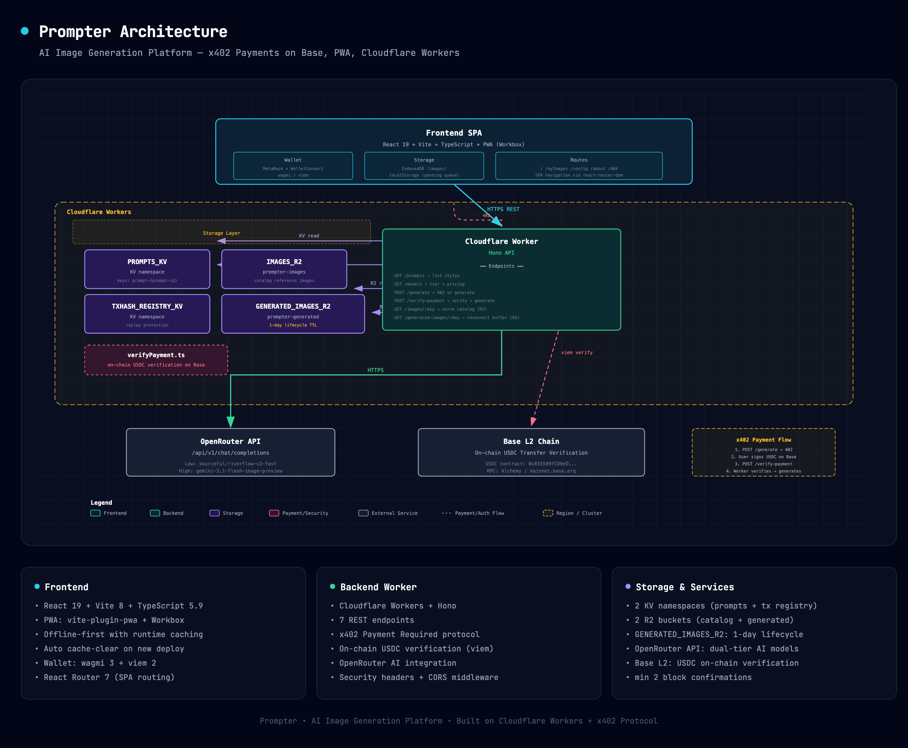

# Prompter

> Transform your images with AI. Pay-per-use with crypto, no subscription required.

[](https://workers.cloudflare.com)
[](https://openrouter.ai)
[](https://x402.org)

Prompt-based AI image generation on Cloudflare Workers with trustless, on-chain x402 payments via USDC on Base.

---

## ✨ Features

- 📸 Reference image upload with drag-and-drop
- 🎨 Curated prompt catalog with live previews
- 🤖 Dual-tier AI generation (OpenRouter: sourceful/riverflow-v2-fast + gemini-3.1-flash)
- 💰 Pay-per-use x402 payments (USDC on Base, no subscriptions)
- 📱 Installable PWA with offline-first caching and auto-recovery on deploy
- 🔍 Auto-generated sitemap, robots.txt, Open Graph meta, and structured data

---

## 🏗 Architecture



*(Full interactive diagram: `docs/architecture.html`)*

---

## 🧰 Tech Stack

| Layer | Technology |
|-------|------------|
| **Frontend** | Vite + React 19 + TypeScript + react-router-dom |
| **Backend** | Cloudflare Workers + Hono |
| **Storage** | KV (prompts, tx registry) + R2 (catalog images, generated images) |
| **AI** | OpenRouter API (dual model tiers) |
| **Payments** | x402 protocol + USDC on Base |
| **Wallet** | wagmi 3 + viem 2 (MetaMask + WalletConnect) |
| **PWA** | vite-plugin-pwa + Workbox (offline-first, auto-update) |
| **Runtime** | Bun |

---

## 🚀 Quick Start

```bash
git clone https://github.com/your-org/prompter.git
cd prompter && bun install

# Terminal 1: Local worker (in-memory KV/R2, auto-seeded, payments bypassed)
bun run dev:local

# Terminal 2: Frontend
cd frontend && bun dev
```

Visit `http://localhost:3000`. Requires [Bun](https://bun.com) and an OpenRouter API key.

---

## 🛠 Environment

### Worker (`wrangler.toml` + secrets)

```env
OPENROUTER_API_KEY=sk-or-v1-...      # secret (wrangler secret put)
X402_LOW_PRICE_USD=0.01
X402_HIGH_PRICE_USD=0.05
X402_PAY_TO_ADDRESS=0x7B3193eEb2d...
LOCAL_DEV_BYPASS_PAYMENT=true        # false for production
BASE_RPC_URL=https://mainnet.base.org
MIN_CONFIRMATIONS=3
```

### Frontend (`frontend/.env.production`)

```env
VITE_API_URL=https://example.xyz
VITE_WALLETCONNECT_PROJECT_ID=...
VITE_UI_BASE_URL=https://example-url.xyz
```

---

## ☁️ Cloudflare Setup

```bash
# KV namespaces
wrangler kv namespace create PROMPTS_KV
wrangler kv namespace create TXHASH_REGISTRY_KV

# R2 buckets
wrangler r2 bucket create prompter-images
wrangler r2 bucket create prompter-generated
wrangler r2 bucket lifecycle add prompter-generated "auto-expire-1d" "" --expire-days 1 --force

# Secrets
wrangler secret put OPENROUTER_API_KEY
```

Update binding IDs in `wrangler.toml`.

---

## 💾 Seed Data

Prompts are stored in KV as `prompt-{prompt-id}` with JSON values. The `prompt` field is stripped from public API responses.

```bash
bun run scripts/populate-kv.ts       # KV from prompts.json
bun run scripts/upload-reference-images.ts  # R2 catalog images
```

---

## 💳 Payment Flow (x402)

1. `POST /generate` → Worker returns HTTP 402 with x402 payment details
2. User signs USDC transfer on Base via wallet
3. `POST /verify-payment` → Worker verifies on-chain via viem:
   - Checks transaction status + confirmations
   - Parses USDC Transfer events
   - Validates amount ≥ price + recipient = `X402_PAY_TO_ADDRESS`
   - Marks tx hash in `TXHASH_REGISTRY_KV` (replay protection)
4. Worker calls OpenRouter → returns generated image
5. Image cached in `GENERATED_IMAGES_R2` (auto-deleted after 1 day)

---

## 🌍 Deploy

```bash
bun run deploy                    # Worker to Cloudflare
bun run deploy:frontend           # Frontend to Cloudflare Pages
```

The `_redirects` file (`/* /index.html 200`) handles SPA routing.

---

## 📂 Structure

```
prompter/
├── worker/                    # Hono API (Cloudflare Worker)
│   ├── index.ts               # 7 REST endpoints
│   ├── dev.ts                 # Local dev server
│   └── utils/verifyPayment.ts # On-chain verification
├── frontend/                  # Vite + React 19 SPA
│   ├── src/components/        # 13 components
│   ├── src/pages/             # 4 routes + 404
│   ├── src/context/           # WalletContext + ImagesContext
│   ├── src/hooks/             # useX402Payment
│   └── vite.config.ts         # PWA, proxy, SEO generation
├── scripts/                   # CLI: KV populate, R2 upload, prompt generator
├── wrangler.toml              # Worker config
└── DESIGN.md                  # Design system (tokens, components, a11y)
```

---

## 📜 License

MIT
